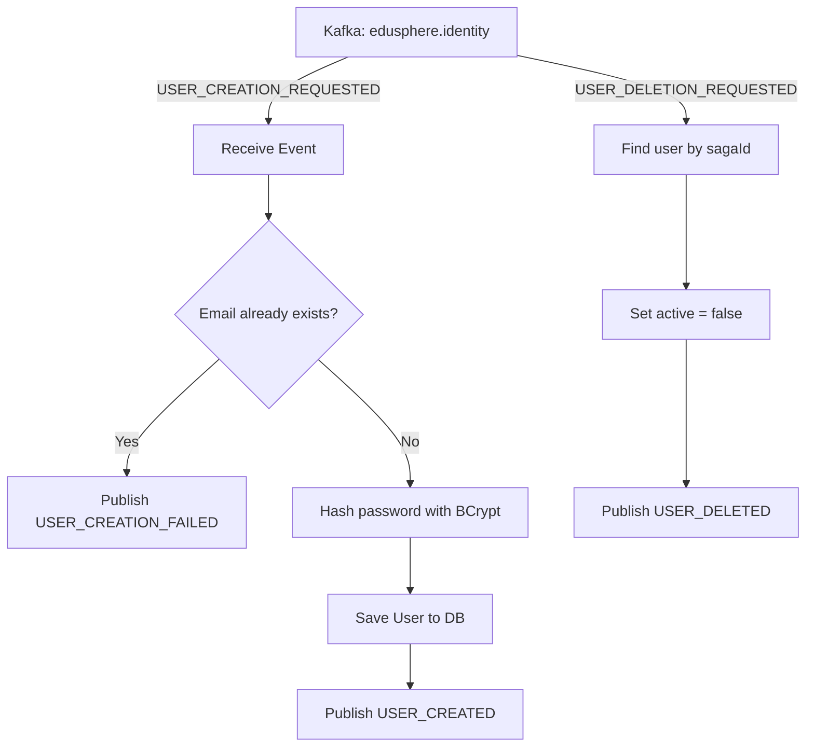

# Edusphere IAM Service (Identity & Access Management)

Creates and manages user accounts for tenant admins. Triggered exclusively via Kafka during the onboarding saga — has no public REST API.

---

## Service Flow

---

## Kafka Events

### Consumes from `edusphere.identity`

| Event Type | Payload Fields | Action |
|---|---|---|
| `USER_CREATION_REQUESTED` | `adminEmail`, `username`, `password`, `adminFirstName`, `adminLastName`, `tenantId` | Creates user with BCrypt-hashed password |
| `USER_DELETION_REQUESTED` | `sagaId` | Deactivates user (sets `active = false`) |

### Produces to `edusphere.identity`

| Event Type | Payload Fields | When Published |
|---|---|---|
| `USER_CREATED` | `userId`, `email`, `tenantId` | User saved successfully |
| `USER_CREATION_FAILED` | `reason`, `email` | Email already exists or DB error |
| `USER_DELETED` | `userId` | User deactivated as compensation |

---

## No REST API

This service has no HTTP endpoints other than the actuator health check:

| Endpoint | Method | Description |
|---|---|---|
| `/actuator/health` | GET | Returns service health status |
| `/actuator/info` | GET | Returns service info |

---

## Database

**Database:** `edusphere_iam_db` (MySQL)

### Table: `users`

| Column | Type | Nullable | Default | Description |
|---|---|---|---|---|
| `id` | BIGINT (PK, AUTO_INCREMENT) | No | — | Primary key |
| `saga_id` | VARCHAR (UNIQUE) | No | — | Saga ID from onboarding |
| `tenant_id` | VARCHAR | No | — | Tenant ID this user belongs to |
| `username` | VARCHAR (UNIQUE) | No | — | Login username (same as email) |
| `password_hash` | VARCHAR | No | — | BCrypt-hashed password |
| `first_name` | VARCHAR | No | — | User's first name |
| `last_name` | VARCHAR | No | — | User's last name |
| `email` | VARCHAR (UNIQUE) | No | — | User's email address |
| `role` | VARCHAR | No | `TENANT_ADMIN` | User role |
| `active` | BOOLEAN | No | `true` | Account active flag |
| `created_at` | DATETIME | No | — | Account creation time |

---

## Configuration

| Environment Variable | Default | Description |
|---|---|---|
| `IAM_SERVER_PORT` | `8091` | Service port |
| `IAM_DB_URL` | `jdbc:mysql://localhost:3306/edusphere_iam_db` | MySQL URL |
| `IAM_DB_USERNAME` | `iam_user` | DB username |
| `IAM_DB_PASSWORD` | `iam_password` | DB password |
| `KAFKA_BOOTSTRAP_SERVERS` | `localhost:29092` | Kafka brokers |
